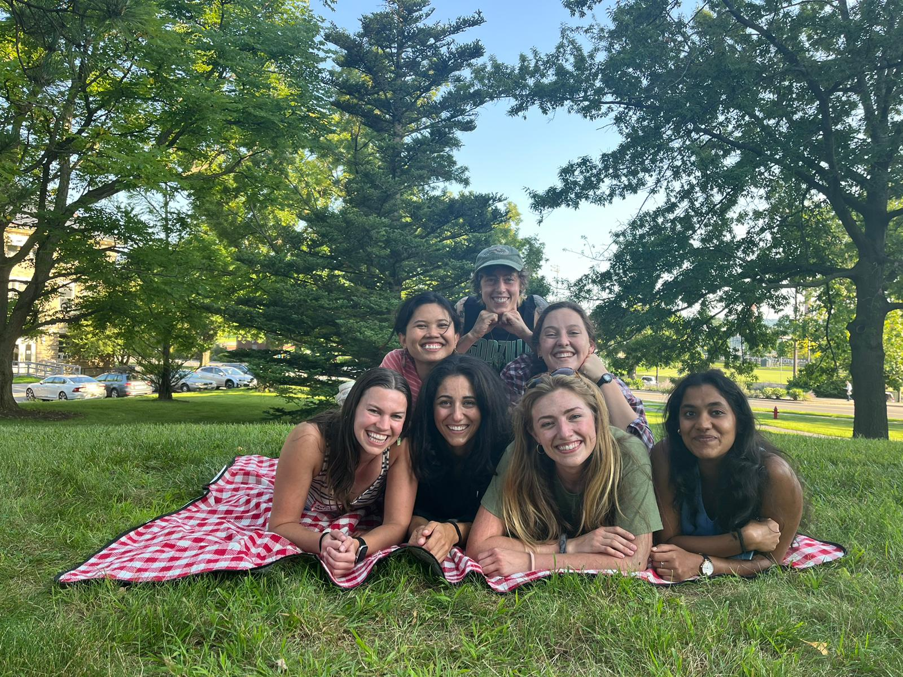

```{r setup, include=FALSE}
knitr::opts_chunk$set(echo = TRUE)
```

## The DNRE GSA Extends a Warm Welcome

<br>

#### Welcome! We are excited you are joining us. We have created this website to practice using Git and Github (we are grad students after all), but also with the purpose of advertising upcoming events and keeping our fellow DNRE grad students informed. This is all with the goal of creating a more cohesive department community. Reach out to us if you have recommendations for activities, questions, or if you would just like to compliment us on our beautiful website <3

<br>

<br>

## Upcoming Events <3
* **Wednesday, Sept. 11** Climbing at Lindseth Climbing Center from **5:30-7:00**
* **Monday, Sept.16** Hiking! Meet at Fernow Grad Lounge at **5:00**
